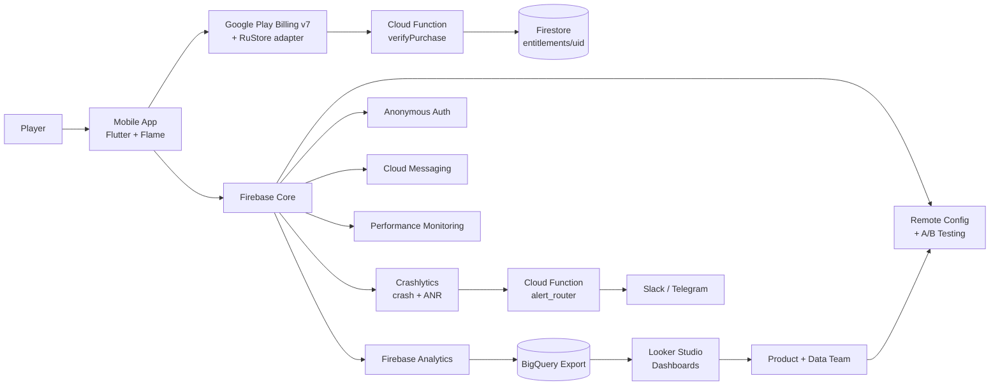
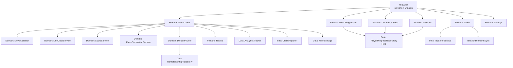
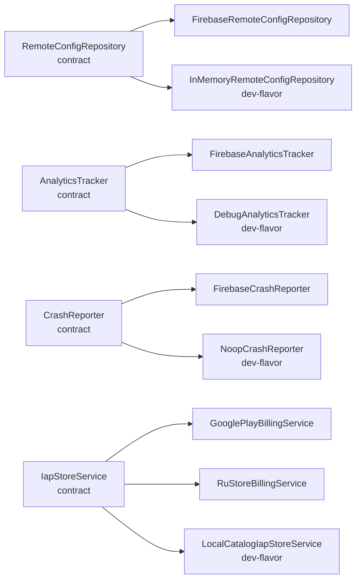
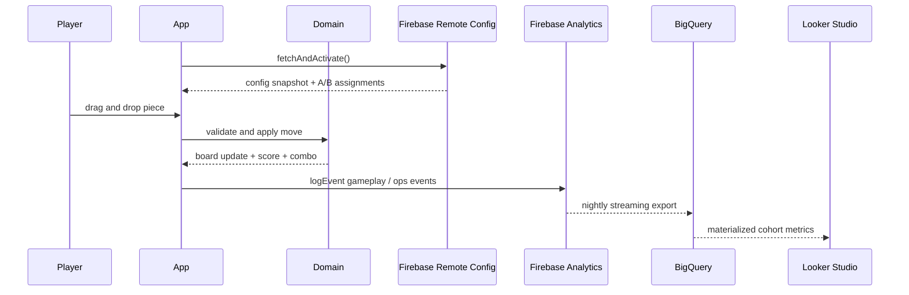
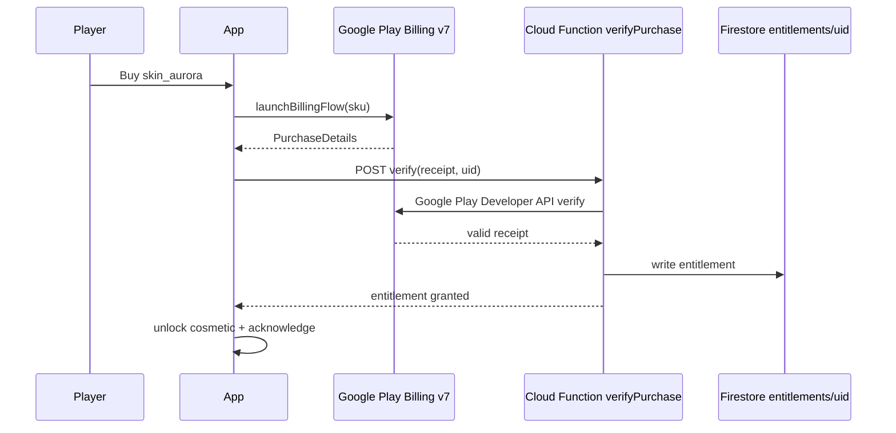
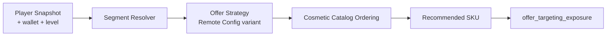

# System Relation Map

Last updated: 2026-04-12. Aligned with the Firebase-first decision in [../roadmap/01_ROADMAP_AND_SPRINTS.md](../roadmap/01_ROADMAP_AND_SPRINTS.md) and [02_ARCHITECTURE_MODULE_CATALOG.md](02_ARCHITECTURE_MODULE_CATALOG.md).

## 1. System Context

## 2. Client Internal Links

## 3. Infra Adapters

## 4. Event / Data Flow

## 5. Purchase + Entitlement Flow

## 6. Store Personalization Chain (Phase 3 3C)

## 7. Control Points
- Before config apply: schema validation + fallback + `ops_config_invalid` on failure.
- Before gameplay state mutation: lifecycle phase gate + `_isDisposed` guard.
- Before crash is lost: `runZonedGuarded` + `FlutterError.onError` + `PlatformDispatcher.instance.onError` route to `CrashReporter`.
- Before purchase grants entitlement: Cloud Function `verifyPurchase` validates against Google Play Developer API.
- Before rollout increase: hard/soft gate evaluation from Looker Studio + [../operations/16_ROLLOUT_GATES_CHECKLIST_OPS_SIGNALS.md](../operations/16_ROLLOUT_GATES_CHECKLIST_OPS_SIGNALS.md).
- Before publish: smoke pack on device matrix + release pipeline checklist.

## 8. Deferred Integrations
- `services/config-api` — deferred in favor of Firebase Remote Config. Historical contract at [../../services/config-api/README.md](../../services/config-api/README.md).
- `services/analytics-pipeline` — deferred in favor of Firebase Analytics + BigQuery export. Historical contract at [../../services/analytics-pipeline/README.md](../../services/analytics-pipeline/README.md).
