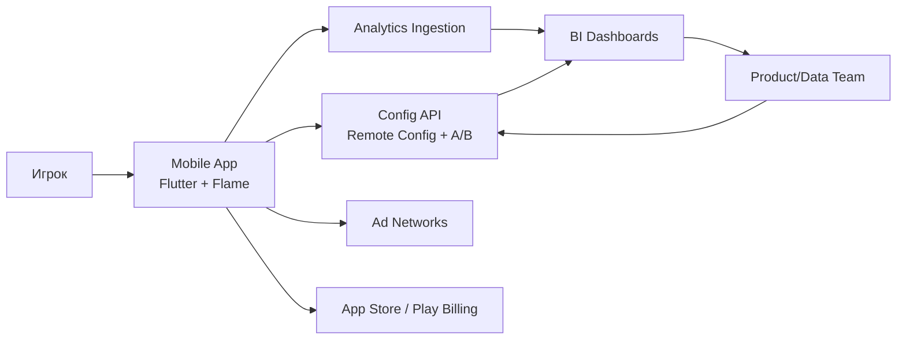
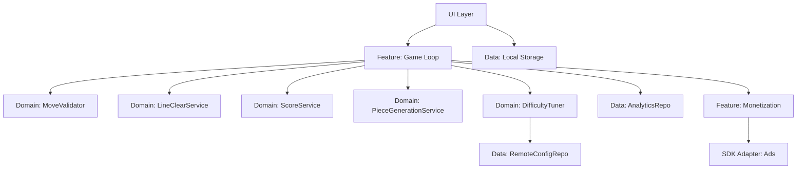
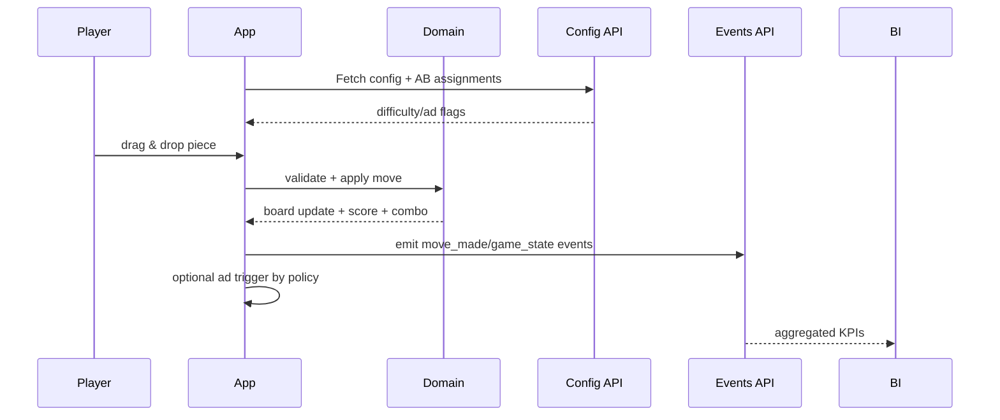
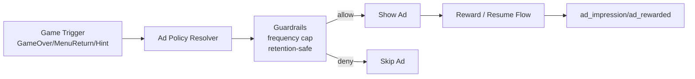

# Карта Связей Системы

## 1. System Context

## 2. Внутренние связи клиента

## 3. Event/Data Flow

## 4. Monetization decision chain

## 5. Зоны ответственности
- Gameplay zone: игровая логика и UX.
- Monetization zone: правила показа и ad adapters.
- Data zone: аналитические события, схемы, агрегация.
- Experimentation zone: remote config, feature flags, AB assignments.

## 6. Критичные точки контроля
- Перед любым ad показом: проверка guardrails.
- Перед применением config: schema validation + fallback.
- Перед выпуском: smoke сценарии полного игрового цикла.
