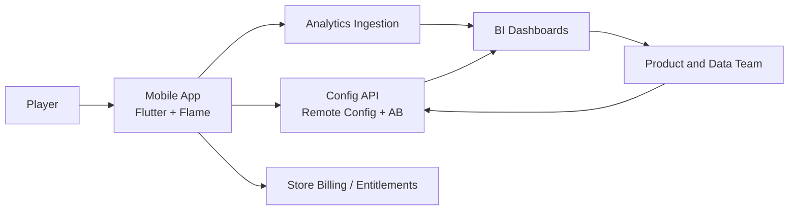
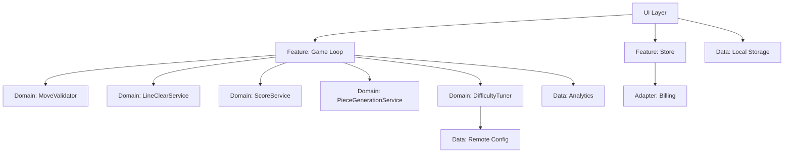
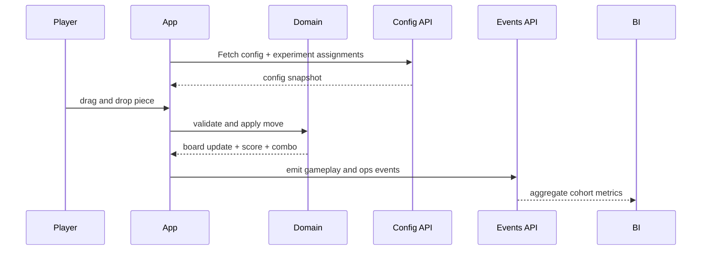
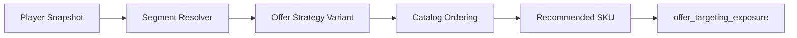

# System Relation Map

## 1. System Context

## 2. Client Internal Links

## 3. Event/Data Flow

## 4. Store Personalization Chain

## 5. Control Points
- Before config apply: schema validation + fallback.
- Before rollout increase: hard/soft gate evaluation.
- Before publish: smoke + release checks.
