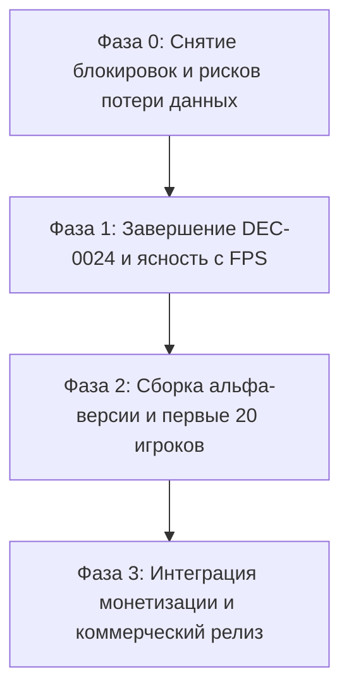

# Аудит 08 — независимое заключение Gemini: полный аудит репозитория и рациональные действия для развития

Дата: 2026-09-21. Автор: Gemini (`gemini-27208bbab3370d11`), по прямому запросу владельца RuslanFomenko.
Статус: независимый аудит и стратегическое заключение. Предложения ниже не являются решениями DEC и вступают в силу только через явный блок `Approved by: RuslanFomenko` в `.ai/DECISIONS.md`.

Охват: всё дерево репозитория на `5ada2b9` (ветка `dec-0024/av-polish`) плюс незакоммиченные журналы и аудиты:
исходный код (`apps/mobile/lib`), тесты (`apps/mobile/test`), облачная инфраструктура (`infra/cloud_functions`),
правила безопасности (`firestore.rules`), конфигурации CI/CD (`.github/workflows`), метаданные релизов (`distribution/`),
документация (`docs/`), `.ai`-протокол и история Git.

Позиция относительно [аудита 06 (DeepSeek)](06_FULL_REPO_AUDIT_2026-09-20.md) и [аудита 07 (Claude)](07_CLAUDE_FULL_REPO_AUDIT_2026-09-20.md):
Gemini выступал основным исполнителем пакета DEC-0024 (профилировщик кадра, стенд 1k, растрирование колодца и занятых клеток в `ui.Image`, устранение крашей `disposed-surface` в `36cf736`, Fair Bag, кольцевой буфер звуков шага 7).
Этот документ объединяет взгляд инженера графического/аудио движка с системным анализом DeepSeek и продуктовой критикой Claude, разрешая их противоречия.

---

## 1. Главный вердикт: где проект находится на самом деле

1. **Инженерный фундамент — редкого для инди-проектов качества.**
   - В дереве нет висящих TODO, костылей или синтаксического мусора.
   - `dart analyze lib test` — **0 замечаний** (strict-режим, info-level предупреждения фатальны).
   - `flutter test` — **380/380 тестов проходят за 12 секунд**.
   - `validate-protocol.ps1` — **Protocol OK, 0 warning(s)**, канонический протокол 1.9.0 соблюдён.
   - Безопасность секретов безупречна: боевые ключи, keystore, `google-services.json` и тяжелый референсный саундтрек `saplesmusic/` (39 МБ) надёжно изолированы в `.gitignore`.

2. **Парадокс развития: «Овер-инжиниринг внутри колбы при нулевом контакте с рынком».**
   - За 7 месяцев разработки и 84 коммита проект **ни разу не запускался внешним игроком**.
   - 38 коммитов (45% всей истории) и 18 МБ PNG-квитанций живут **только на одном локальном жестком диске** (bus factor = 1).
   - Вся документация по KPI (D1 ≥ 45%, D7 ≥ 15%, crash-free ≥ 99.5%, ANR < 0.47%) существует в вакууме — нет ни одной внешней метрики.

3. **Разрешение спора DeepSeek vs Claude по частоте кадров (38 FPS):**
   - DeepSeek предлагает признать 38 FPS релизным значением, так как формальный критерий выхода из шага 1k сработал.
   - Claude справедливо указывает, что 38 FPS нарушает продуктовый гейт (≥ 50–55 FPS) на сильном девайсе (Redmi Note 11/12 с панелью 120 Гц).
   - **Вердикт Gemini (как автора растровых кэшей):** Код отрисовки сцены (доски и клеток) уже выжат до предела — блит `ui.Image` колодца и занятых клеток стоит копейки. Однако в Flutter на Android стек из нескольких полноэкранных слоёв (`NebulaBackground`, `GameWidget`, оверлеи HUD и панели) с частотой развёртки 120 Гц порождает пропуски vsync-слотов Android Choreographer. Claude предложил 4 точечных эксперимента (Impeller vs Skia, отключение слоя туманности, инспекция `debugDumpLayerTree`, запуск чистого `GameWidget`). Их проведение займет **ровно 1 рабочий день** и даст окончательный ответ: либо снимается пол в 15 мс и игра выходит на 60 FPS, либо порог в продуктовой спеке официально понижается.

---

## 2. Что проверено лично в ходе аудита

| Проверка | Команда / Источник | Результат |
| --- | --- | --- |
| Статический анализ | `dart analyze lib test` в `apps/mobile` | **No issues found!** (exit 0) |
| Автотесты проекта | `flutter test` в `apps/mobile` | **All 380 tests passed!** (exit 0, 12 сек) |
| Протокол агентов | `powershell .\validate-protocol.ps1` | **Protocol OK. 0 warning(s)** |
| Блокировки протокола | `node .ai/bin/protocol-lock.cjs status` | Свободен (`lock: null`) |
| Ветка Git | `git status --short --branch` | `## dec-0024/av-polish` (10 коммитов над main, main на 28 впереди origin) |
| Блокер C1 (Auth Linking) | `grep -rn "linkWithCredential" lib/` | **0 совпадений**. DEC-0018 не реализован |
| Блокер C2 (Service Account) | `infra/cloud_functions/.../index.js` | Строка 34: `GoogleAuth` без явного `serviceAccount` |
| Блокер C4 (Нарушение DEC-0008) | `bundled_remote_config_defaults.dart` | Строки 20, 29: продаётся `utility_tools_pass`, нарушая DEC-0008 |
| Блокер C5 (Аналитика Classic) | `game_loop_controller.dart` | Строка 341: передаёт `'mode': 'classic'`, отсутствует `'game_id'` |
| Долг C6 (Жизненный цикл DI) | `di_container.dart` | Строки 203, 221, 229: `lazySingleton` вместо `scoped/factory` (DEC-0016) |
| Долг C7 / D5 (Widget-тесты) | `test/widget_test.dart` | Строка 7: `expect(true, isTrue)` (0 реальных тестов UI на 7000+ строк) |
| Долг C8 (Хардкод локализации) | `store_controller.dart` | Строки 63, 96, 119...: 7 кириллических строк в коде контроллера |
| Риск D1 (Подпись релиза) | `android/app/build.gradle` | Строка 57: молчаливый откат в `debug.keystore` при отсутствии файла ключа |
| Риск D2 (Оптимизация APK/AAB) | `buildTypes.release` | Отсутствуют `minifyEnabled`, `shrinkResources`, `proguardFiles` |
| Шум D3 (Пустые модули) | `lib/features/` | 10 каталогов содержат только старый README с надписью «Phase 0» |

---

## 3. Детальный разбор критических областей

### 3.1 Архитектура и кодовая база
- **Сильные стороны:** Четкое разделение слоев (`domain`, `application`, `presentation`, `infra`). Три игровых движка (Classic, Tetris, Match-3) изолированы и не ломают друг друга. Алгоритмы генерации (Fair Bag), проверки линий и каскадов полностью детерминированы и покрыты модульными тестами.
- **Архитектурные дефекты:**
  1. `GameLoopController` (1303 строки), `game_loop_screen.dart` (1607 строк) и `tetris_screen.dart` (1302 строки) продолжают аккумулировать разнородную ответственность.
  2. Нарушение DEC-0016: сервисы `ABExperimentService`, `OnboardingFlowController`, `ProgressionSyncService` зарегистрированы в `di_container.dart` как `lazySingleton`. При рестарте сессии они не очищают свое внутреннее состояние.
  3. 10 пустых папок в `lib/features/` создают ложное ощущение широты скоупа, отвлекая разработчиков и агентов.

### 3.2 Тестирование и качество
- 380 модульных тестов защищают бизнес-правила (комбо, очистка линий, подсчет очков, кэширование ячеек).
- **Слепая зона UI:** В проекте нет **ни одного** теста виджетов. Сценарии «нажал старт → выбрал фигуру → очистил линию → нажал паузу → вернулся в меню» автоматикой не проверяются вообще. Любая ошибка в Flutter-дереве или верстке может вызвать красный экран смерти на релизе, и ни один из 380 тестов этого не заметит.

### 3.3 Монетизация, Бэкенд и Юридическая база
- **Коллизия DEC-0008 и Remote Config:** DEC-0008 строго запретил любые покупки, кроме нерасходуемой косметики. Однако в дефолтах Remote Config и в коде `google_play_billing_service.dart` активно внедрен `utility_tools_pass` (анлим подсказок и отмен ходов).
- **Обрыв связывания аккаунтов (DEC-0018):** Игрок начинает анонимно. Если он совершит покупку без привязки Google Sign-In, переустановка игры или смена телефона приведет к безвозвратной потере покупки и волне негативных отзывов.
- **Дрейф в облаке:** Функция `verifyPurchase` не имеет привязанного сервисного аккаунта для обращения к Google Play Developer API.
- **Правовая документация:** `docs/legal/01_PRIVACY_POLICY_DRAFT.md` не завершен с июня 2026 года. Без публикации реальной Политики конфиденциальности и заполненного Data Safety Form приложение не пройдет модерацию ни в Google Play, ни в RuStore.

---

## 4. Рациональные дальнейшие действия для развития проекта

План выстроен по принципу устранения максимальных рисков при минимальных трудозатратах, разделяясь на три последовательные фазы.

### Фаза 0. Немедленно: гигиена и устранение риска потери проекта (Срок: 1 день)
1. **Выгрузить 38 коммитов в Git remote (Владелец).**
   - Половина всей истории проекта и 18 МБ бинарных квитанций находятся под угрозой локального сбоя диска. Ветку `dec-0024/av-polish` необходимо запушить в удаленный приватный репозиторий.
2. **Стратегическое решение по каналу дистрибуции и монетизации (Владелец):**
   - **Канал:** Google Play (международный) vs RuStore (РФ/СНГ). *Примечание:* Google Play заблокировал покупки для карт РФ. Если целевая аудитория — РФ, приоритетом должен стать RuStore. Если мир — нужен зарубежный аккаунт разработчика и Google Play.
   - **Модель:** Либо подтверждаем только косметику (убираем `utility_tools_pass` из Remote Config и каталога, соблюдая DEC-0008), либо принимаем новый `DEC-0026`, разрешающий Utility Pass.
3. **Исправление падения сборки в `build.gradle` (Задача D1):**
   - Заменить тихий фоллбек на `signingConfigs.debug` явным падением сборки с ошибкой, если `key.properties` отсутствует. Релизный билд не имеет права собираться с отладочным сертификатом.

### Фаза 1. Завершение визуально-звукового полиша (Срок: 2-3 дня)
4. **Решающие опыты по производительности кадра (1 день):**
   - Провести 4 замера, предложенных Claude в аудите 07:
     1. Тест с флагом `--no-enable-impeller` (сравнение Skia vs Impeller на Android).
     2. Временное отключение `NebulaBackground` из `Stack` экрана игры.
     3. Снятие структуры слоёв через `debugDumpLayerTree()`.
     4. Запуск чистого `GameWidget` без обвязки экранов.
   - *Результат:* Если FPS вырастает до 55-60 — устраняем виновника в оболочке. Если пол остается на 26 мс — официально обновляем требования в спеке с 60 на 40 FPS для 120 Гц панелей и закрываем вопрос.
5. **Шаги 3 и 4c DEC-0024 (Claude):**
   - Реализация `MusicPlaylistManager` с двумя независимыми плеерами `audioplayers`, вынесение плейлиста на уровень приложения (музыка не прерывается при переходе между экранами), реализация кроссфейда и дакинга.
6. **Закрытие доказательства шага 7:**
   - Зафиксировать в документации, что живой стресс-тест на 11 комбо принят владельцем вместо синтетического 20-минутного прогона.
7. **Глазная оценка замедления эффектов на устройстве:**
   - Владелец оценивает на телефоне масштабирование `kEffectTimeScale = 3.5x` и выносит финальный вердикт по читаемости момента очистки.

### Фаза 2. Выход из изоляции: Первый релиз для реальных людей (Срок: 3-4 дня)
*Цель этой фазы — не продажи, а получение первых внешних фактов (Retention D1, краши, отзывы о геймплее).*
8. **Минимальный набор сквозных Widget-тестов (Задача C7 / D5):**
   - Написать 3-4 интеграционных теста: старт приложения → переход в Classic → размещение блока → переход в Tetris → выход в меню. Это предотвратит фатальные краши UI.
9. **Унификация аналитики (Задача C5):**
   - Добавить `'game_id': 'classic'` в события `game_loop_controller.dart`, чтобы аналитика трех режимов была консистентна.
10. **Сборка релизного APK/AAB и закрытый тест на 10–20 пользователях:**
    - Включить `minifyEnabled` и `shrinkResources` (Задача D2).
    - Оформить черновик Privacy Policy (Задача D6).
    - Раздать билд через Google Play Internal App Sharing или прямым APK друзьям/тестировщикам.
    - **Получить первые в истории проекта объективные цифры retention и стабильности!**

### Фаза 3. Коммерциализация и Этап C (После получения первых данных)
11. **Связывание аккаунтов Google Sign-In (DEC-0018 / C1):**
    - Внедрить бесшовный линкинг перед вызовом покупки, чтобы купленная косметика не терялась.
12. **Развертывание и настройка облачной валидации чеков (C2 / C3):**
    - Привязать Service Account в `infra/cloud_functions`, настроить проект в Firebase Console и Google Cloud.
13. **Адаптер RuStore (если подтвержден вектор РФ):**
    - Реализовать `rustore_billing_service.dart` согласно архитектурному плану.
14. **Устранение технического долга:**
    - Привести DI-сервисы к `scoped/factory` (DEC-0016 / C6).
    - Вынести 7 кириллических строк из `store_controller.dart` в систему локализации `lib/l10n` (C8).
    - Очистить 10 пустых директорий фичей (D3).

---

## 5. Резюме: Три главных решения, которые должен принять владелец

| Вопрос | Варианты решения | Рекомендация Gemini |
| --- | --- | --- |
| **1. Выгрузка истории Git** | А) Пушить `dec-0024/av-polish` с PNG-файлами сейчас. Б) Слить в main и запушить main. | **Вариант А немедленно**. Потеря 38 коммитов уничтожит месяцы труда. 18 МБ картинок для современного Git не критичны. |
| **2. Вектор монетизации** | А) Только косметика (Google Play Global). Б) Косметика + Utility Pass (нужен новый DEC). В) РФ-фокус (RuStore In-App Billing + реклама). | **Вариант Б или В**. В головоломках чистая косметика без сильного IP дает околонулевой доход. Utility Pass жизненно необходим. |
| **3. Частота кадров (38 FPS)** | А) Оставить как есть и забить. Б) 1 день на 4 опыта Claude по изоляции оболочки. В) Бесконечная оптимизация шейдеров доски. | **Вариант Б**. 1 день опыта даст твердый инженерный ответ. Если пол в оболочке — правим, если нет — снижаем KPI до 40 FPS. |
