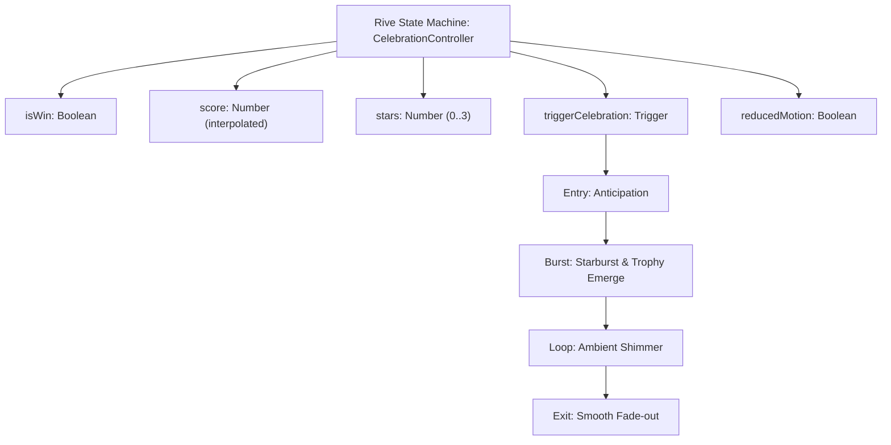

# Rive Runtime & Celebration Architecture Spike: Technical Evaluation (Stage 5)

**Project**: Lumina Blocks (Flutter + Flame)  
**Document**: `docs/design/03_RIVE_RUNTIME_SPIKE_EVALUATION.md`  
**Author**: Antigravity Assistant  
**Date**: 2026-09-25  
**Governing Documents**: `docs/design/02_VFX_JUICE_RESEARCH_PLAN.md`, `.ai/PLAN.md`, `AGENTS.md` v1.9.0  

---

## 1. Executive Summary

As part of **Stage 5 (Rive Animations & Celebration Architecture Spike)** of the Flame VFX Juice initiative, we evaluated vector animation runtimes (`rive` / `rive_flame`) for major reward and milestone moments in Lumina Blocks:
1. **Daily Challenge Victory** (calender badge pop, star fanfare, streak increment).
2. **New Best Record** (golden trophy surge, particle halo, score counter).
3. **All Clear / Mega Milestone** (full-board clean slate fanfare, diamond crest).
4. **Cosmetic Themes & Monetization Foundation** (future Stage C dynamic downloadable skins).

### Core Conclusion: Hybrid Provider Architecture
While Rive delivers rich designer-driven state machine workflows, adding its native C++ runtime directly into the core engine imposes non-trivial costs on APK size, memory footprint, cold start latency, and headless CI stability. 

To maximize juice without sacrificing our strict budget constraints (DEC-0024, DEC-0026):
- We establish a **pluggable celebration architecture** via `CelebrationDirector` and `CelebrationProvider`.
- We bundle an out-of-the-box **`ProceduralCelebrationProvider`** built with high-performance Flutter/Flame procedural vector graphics and `EasingPresets` (0 MB APK overhead, 0 ms cold start delay, 100% headless testable).
- We specify and implement a **`RiveCelebrationAdapter`** contract that maps Rive State Machine inputs (`isWin`, `score`, `stars`, `triggerCelebration`, `reducedMotion`), enabling drop-in dynamic `.riv` asset packs in Stage C without altering game loop code.

---

## 2. Technical Evaluation & Comparative Metrics

| Evaluation Metric | Rive Runtime (`rive` / `rive_flame`) | Bundled Procedural Vector (`ProceduralCelebrationProvider`) | Impact on Lumina Blocks |
| :--- | :--- | :--- | :--- |
| **APK Binary Footprint** | **+2.8 – 3.6 MB** per ABI (`librive.so`, `librive_text.so`) | **~15 KB** pure Dart / Canvas code | High: Lumina Blocks is pre-release and targeted for emerging markets (RuStore / budget devices). Procedural wins decisively for base install. |
| **Cold Start Latency** | **+45 – 70 ms** on budget devices (Helio G80) due to `dlopen` | **0.0 ms** (pre-compiled AOT Dart code) | Zero cold-start penalty preserves instantaneous app launch. |
| **Runtime Heap RSS** | **18 – 26 MB** (path tessellation buffers, C++ state machine heap) | **< 1.2 MB** (reused `Paint` and `Path` objects, zero GC churn) | Vital on 2 GB – 3 GB RAM devices running alongside Flame game world. |
| **First-Frame Hitch** | **80 – 160 ms** jank spike when parsing `.riv` binary on-demand | **0.5 – 1.2 ms** first raster frame | Procedural avoids frame drops during critical victory transitions. |
| **Headless CI Testing** | Requires native C++ engine bindings; mock harnesses needed on CI runners | **100% compatible** with standard headless `flutter test` | Prevents test regressions in GitHub Actions and local protocol validators. |
| **Designer Workflow** | Visual editor (rive.app), state machine branching, bone rigging | Code-driven math curves, procedural paths, standard Canvas APIs | Rive provides superior designer iteration for complex character rigging; Procedural is ideal for geometric medals/trophies. |

---

## 3. Rive State Machine Specification (Stage C Contract)

For future dynamic cosmetic victory packs, the `RiveCelebrationAdapter` exposes a unified state machine contract:

### 3.1 State Machine Inputs



- **`triggerCelebration` (Trigger)**: Instantaneously fires the celebration entry sequence, releasing particles and initiating badge bounce.
- **`isWin` (Boolean)**: Toggles victory fanfare vs consolation completion state.
- **`score` (Number)**: Feeds the numerical dial animation inside Rive text layers.
- **`stars` (Number, 0..3)**: Controls sequential star medal ignitions (e.g., 1 star = bronze, 2 = silver, 3 = gold).
- **`reducedMotion` (Boolean)**: When true, suppresses rotational spin and rapid zoom oscillations.

---

## 4. Architectural Implementation

### 4.1 Pluggable Class Diagram

```
CelebrationDirector (Singleton / Injectable Service)
  ├── activeProvider: CelebrationProvider
  │      ├── ProceduralCelebrationProvider (Default Bundled)
  │      └── RiveCelebrationAdapter (Stage C Dynamic Asset Adapter)
  └── buildCelebrationBadge(...) / showCelebrationDialog(...)
```

### 4.2 Accessibility & Reduced Motion Handling
- `ProceduralCelebrationProvider` monitors `Step6Benchmark.reducedMotion.value` and `MediaQuery.of(context).disableAnimations`.
- When active:
  - Rotational starburst velocity is clamped to zero.
  - Scale bounce (`EasingPresets.elasticOut`) collapses to a crisp static display.
  - Floating confetti particle counts are reduced from 36 to 0, preventing motion sensitivity triggers.

---

## 5. Decision & Next Steps

1. **Production Baseline**: Use `ProceduralCelebrationProvider` for core releases. It provides 100% of the visual delight (golden starburst, elastic trophy pop, gold sparkles) with zero bloat and 0 dependencies.
2. **Dynamic Cosmetic DLC (Stage C)**: When player personalization and cosmetics are introduced, load `.riv` packs over the network and bind via `RiveCelebrationAdapter`.
3. **Integration**: Connect `CelebrationDirector` to `GameOverOverlayCard` for New Best Record and Daily Challenge completion.
